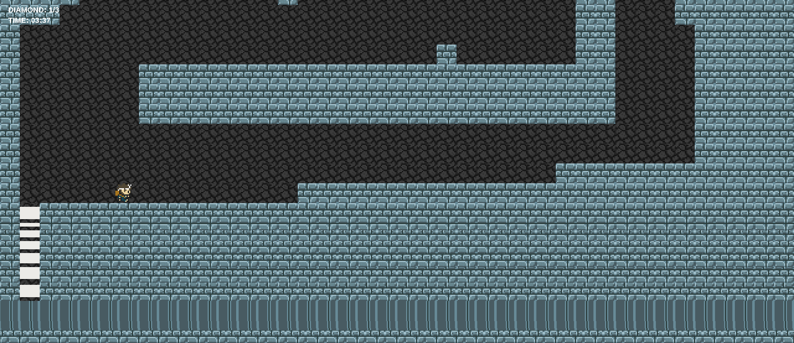
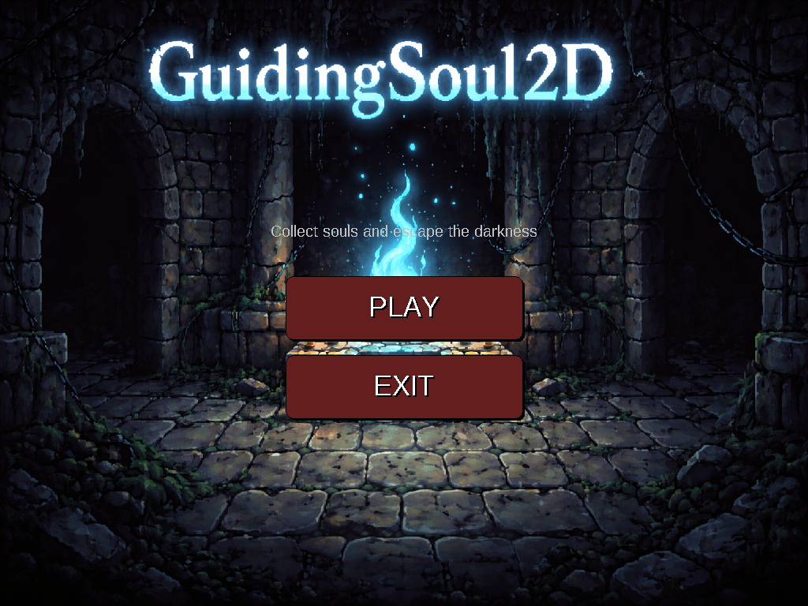
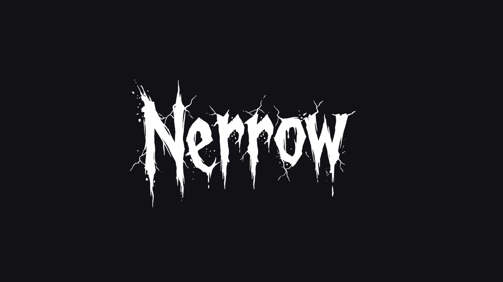

# TRM Game Showcase & Project Repository

Repositori ini merupakan media pengumpulan, arsip, dan etalase karya proyek pengembangan game yang diciptakan oleh mahasiswa program studi Teknologi Rekayasa Multimedia (TRM).

---

## Daftar Proyek dan Pengembang

| Nama Game | Platform | Teknologi | Pengembang |
|---|---|---|---|
| Platform Maze Game | Desktop (Multiplatform) | Java Swing, Maven | NABIL DAVA UTAMA (24903460048)<br>ARDI HARYANTO (24903460043)<br>MUHAMMAD BARIQ SYIHAB MUSAFA IZDI. (24903460055) |
| Souls 2D | Desktop (Multiplatform) | Java Swing | AZWAN MUHAMMAD NAMOUS HAQ (24903460040)<br>Muhammad Farrel Kresnaldy (24903460041)<br>FACHRI FADHILLA SHULHAN (24903460046) |
| Nerrow | Windows (x64) | Unity Engine, C# | Faris Aghna (23903460032) - [@frsaghna](https://github.com/frsaghna) |
| Clumsy Thief | Android (Mobile) | Unity Engine, Android SDK | Muhammad Farrel Kresnaldy (24903460041)<br>ARDI HARYANTO (24903460043)<br>MUHAMMAD BARIQ SYIHAB MUSAFA IZDI. (24903460055) |

---

## Unduhan Berkas Rilis (Siap Main)

Seluruh berkas eksekutabel mandiri dan installer aplikasi dapat diunduh langsung melalui tautan rilis berikut:

- Halaman Unduhan Rilis: [GitHub Releases v1.1.0](https://github.com/muadzhdz/trm-game-showcase/releases/tag/v1.1.0)

Daftar Berkas:
1. `PlatformMazeGame.jar` - Biner eksekutabel Java (memerlukan JRE/JDK 17+).
2. `Souls2D.jar` - Biner eksekutabel Java (memerlukan JRE/JDK 17+).
3. `NerrowBuild-Windows-x64.zip` - Paket mandiri game Unity Windows 64-bit.
4. `nerroww.exe` - Biner klien game Nerrow.
5. `Clumsy-Thief.apk` - Paket instalasi untuk perangkat Android.

---

## Rincian Permainan

### 1. Platform Maze Game



Game puzzle labirin 2D berbasis ubin (grid-based) dengan mekanik navigasi kooperatif. Pemain bertugas mengumpulkan semua kristal diamond yang tersebar di sepanjang lintasan labirin dan mencapai pintu keluar untuk lanjut ke stage berikutnya.

- Tim Pengembang:
  - NABIL DAVA UTAMA (24903460048)
  - ARDI HARYANTO (24903460043)
  - MUHAMMAD BARIQ SYIHAB MUSAFA IZDI. (24903460055)
- Kontrol:
  - Gerak Horizontal: `A` / `D`
  - Gerak Vertikal: Tombol Panah `UP` / `DOWN`
- Menjalankan Game:
  ```bash
  java -jar PlatformMazeGame.jar
  ```

---

### 2. Souls 2D



Game petualangan horor 2D top-down berlatar ruang bawah tanah misterius. Pemain harus menjelajahi lorong-lorong gelap, menghindari patroli musuh bayangan, mengumpulkan serpihan jiwa (soul), dan menyalakan altar kuno untuk membuka pintu gerbang utama dan melarikan diri.

- Tim Pengembang:
  - AZWAN MUHAMMAD NAMOUS HAQ (24903460040)
  - Muhammad Farrel Kresnaldy (24903460041)
  - FACHRI FADHILLA SHULHAN (24903460046)
- Kontrol:
  - Gerakan Karakter: `W`, `A`, `S`, `D` atau `Tombol Panah`
  - Interaksi Altar / Objek: Tombol `E`
  - Pause / Menu: Tombol `ESC` / `ENTER`
- Menjalankan Game:
  ```bash
  java -jar Souls2D.jar
  ```

---

### 3. Nerrow



Game eksplorasi horor sudut pandang orang pertama (first-person) yang dikembangkan menggunakan Unity Engine. Game ini menitikberatkan pada atmosfer lorong gelap, efek tata cahaya minim, serta teka-teki interaksi fisik objek di sekitar pemain.

- Pengembang:
  - Faris Aghna (23903460032) - [@frsaghna](https://github.com/frsaghna)
- Repositori Asli:
  - [https://github.com/frsaghna/Nerrow](https://github.com/frsaghna/Nerrow)
- Kontrol:
  - Pergerakan: `W`, `A`, `S`, `D`
  - Arah Pandang: Mouse
  - Interaksi: Klik Kiri Mouse / Tombol `E`
- Menjalankan Game:
  - Ekstrak berkas `NerrowBuild-Windows-x64.zip`, lalu jalankan `nerroww.exe`.

---

### 4. Clumsy Thief

Game kasual mobile berbasis Android yang menguji kecepatan refleks pemain dalam melakukan manuver, menghindari rintangan, dan menyelesaikan target level yang menantang.

- Tim Pengembang:
  - Muhammad Farrel Kresnaldy (24903460041)
  - ARDI HARYANTO (24903460043)
  - MUHAMMAD BARIQ SYIHAB MUSAFA IZDI. (24903460055)
- Platform:
  - Android 8.0 ke atas
- Kontrol:
  - Layar sentuh (touchscreen)
- Menjalankan Game:
  - Unduh dan instal berkas `Clumsy-Thief.apk` pada perangkat ponsel atau tablet Android.

---

## Hak Cipta dan Lisensi

Seluruh hak cipta materi, desain grafis, kode sumber, dan biner game dimiliki oleh masing-masing mahasiswa pengembang program studi Teknologi Rekayasa Multimedia (TRM). Repositori ini dikelola untuk keperluan arsip akademik dan portofolio karya multimedia.
